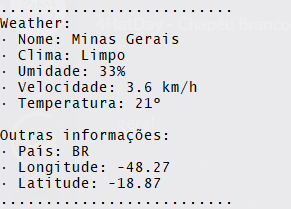

# WeatherMap

Apenas um **simples** script.py de clima(Weather).

## **Como usar:**
* Ter o [Python 3](https://www.python.org/downloads/release/python-366/) instalado.
* Instalar a lib [Requests](https://pypi.org/project/requests/).
* Você terá que pegar uma API Key no site [OpenWeatherMap](https://openweathermap.org/api).
* Add sua API Key na variável [apikey](clima.py#L7).

## **Imagens:**
* 
* 

Criado por: **BlackZacky**

# **:D**
